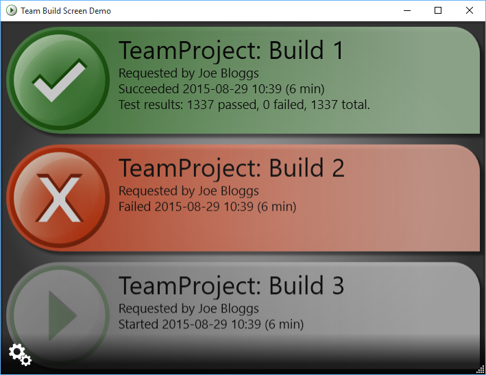
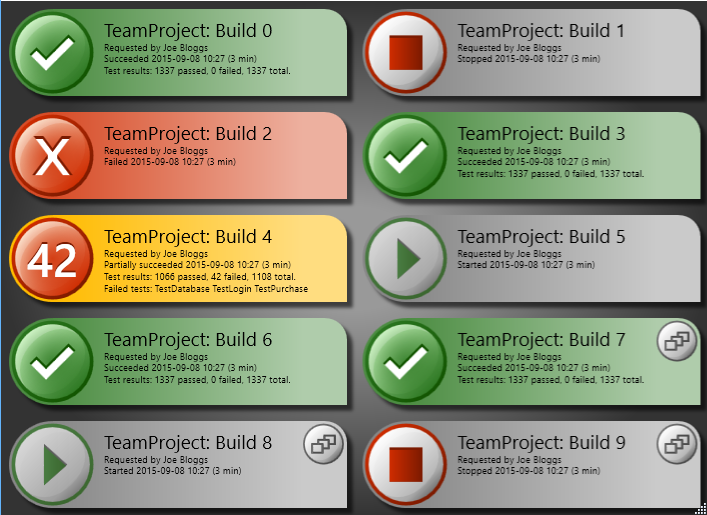

**Project Description**
Displays the active status of build definitions from Team Foundation Server 2015, 2013, 2012, 2010 or Visual Studio Online.

Team Build Screen was originally created by [Jim Liddell](http://liddellj.com). The project has received many excellent [contributions](http://teambuildscreen.codeplex.com/team/view) and is always happy to see more. If you are interested in helping please contact [Staffan](https://www.codeplex.com/site/users/view/StaffanW).

**Features**
* Supports Visual Studio Online, TFS 2015, TFS 2013, TFS 2012 and TFS 2010.
* Basic support for Jenkins (source only - no installer)
* Communicates the status of the build in real-time
* Implemented as a desktop application and a screen saver
* Supports multiple build definitions
* Supports multiple team projects
* Information displayed includes:
	* Team project name
	* Build definition name
	* Build status
	* Requested by
	* Started on
	* Completed on
	* Test results
	* Code coverage
	* Build queued icon
	* Older builds appear faded
**Project Status**
The current recommended release is [release:617325](release_617325). This release introduces official support for TFS 2015 and is backward compatible with TFS 2013, 2012, 2010 and Visual Studio Online.

The project is being semi-actively maintained, and contributions are welcome.

**Screenshot - Desktop Application**
The controls to access the settings only appear with mouse movement. After a short delay they are hidden.

**Screenshot - Desktop Application Full Screen or Screen Saver**
When running the desktop application in full screen, moving the mouse reveals controls to access the settings or minimise/restore/close the window. After a short delay they are hidden.

**Requirements**
To install and run Team Build Screen you must have the following installed:
* [Microsoft .NET Framework 4.5](http://www.microsoft.com/en-us/download/details.aspx?id=30653) or higher.

**Feedback**
* Report any issues using the [Issue Tracker](http://teambuildscreen.codeplex.com/WorkItem/List.aspx)